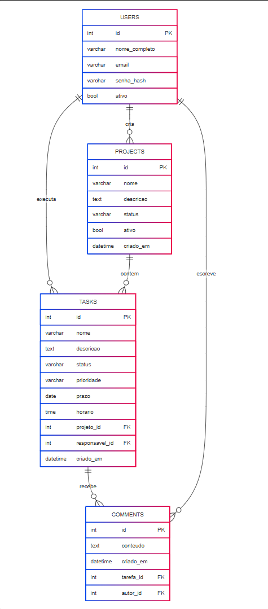

# Gerenciador de Tarefas

Sistema web para gerenciamento de projetos e tarefas com funcionalidades de colaboração e comentários, desenvolvido como projeto acadêmico utilizando Node.js, Express e PostgreSQL.

## Descrição

Aplicação web que permite aos usuários criar e gerenciar projetos, organizar tarefas por prioridade e status, atribuir responsáveis e colaborar através de comentários. O sistema inclui autenticação de usuários, dashboard com visão geral dos projetos e interface moderna e responsiva.

## Estrutura do Projeto

```
GERENCIADOR-DE-TAREFAS/
├── assets/
│   └── dashboard.png
│   └── diagrama-relacional.png
│   └── landing.png
│   └── login.png
├── config/
│   └── database.js
├── controllers/
│   ├── authController.js
│   ├── commentsController.js
│   ├── dashboardController.js
│   ├── projectsController.js
│   └── tasksController.js
├── middleware/
│   └── authMiddleware.js
├── models/
│   ├── commentsModel.js
│   ├── projectsModel.js
│   ├── tasksModel.js
│   └── usersModel.js
├── repositories/
│   ├── commentsRepository.js
│   ├── dashboardRepository.js
│   ├── projectsRepository.js
│   ├── tasksRepository.js
│   └── usersRepository.js
├── routes/
│   ├── authRoutes.js
│   ├── commentsRoutes.js
│   ├── dashboardRoutes.js
│   ├── projectsRoutes.js
│   └── tasksRoutes.js
├── scripts/
│   ├── init.sql
│   └── runSQLScript.js
├── services/
│   ├── commentsService.js
│   ├── dashboardService.js
│   ├── projectsService.js
│   ├── tasksService.js
│   └── usersService.js
├── views/
│   ├── auth/
│   │   ├── cadastro.ejs
│   │   └── login.ejs
│   ├── comments/
│   │   └── lista.ejs
│   ├── dashboard/
│   │   └── home.ejs
│   ├── projects/
│   │   ├── cadastro.ejs
│   │   ├── detalhes.ejs
│   │   ├── editar.ejs
│   │   └── lista.ejs
│   ├── tasks/
│   │   ├── cadastro.ejs
│   │   ├── detalhes.ejs
│   │   ├── editar.ejs
│   │   └── lista.ejs
│   └── index.ejs
├── .env.exemple
├── .gitignore
├── package.json
├── README.md
└── server.js
```

## Como Executar

### Pré-requisitos
- Node.js
- PostgreSQL
- npm

### Instalação

1. **Clone o repositório**
   ```bash
   git clone <url-do-repositorio>
   cd gerenciador-de-tarefas
   ```

2. **Instale as dependências**
   ```bash
   npm install
   ```

3. **Configure as variáveis de ambiente**
   ```bash
   cp .env.exemple .env
   ```
   
   Edite o arquivo `.env` com suas configurações:
   ```env
   DB_USER=seu_usuario_postgres
   DB_HOST=localhost
   DB_DATABASE=gerenciador_tarefas
   DB_PORT=5432
   DB_PASSWORD=sua_senha
   DB_SSL=false
   PORT=3000
   ```

4. **Configure o banco de dados**
   ```bash
   # Crie o banco de dados no PostgreSQL
   createdb gerenciador_tarefas
   
   # Execute o script de inicialização
   psql -d gerenciador_tarefas -f scripts/init.sql
   ```

5. **Execute a aplicação**
   ```bash
   npm start
   ```

6. **Acesse a aplicação**
   ```
   http://localhost:3000
   ```

## Modelo Físico do Banco de Dados

```sql
-- USERS
CREATE TABLE users (
    id SERIAL PRIMARY KEY,
    nome_completo VARCHAR(100) NOT NULL,
    email VARCHAR(100) UNIQUE NOT NULL,
    senha_hash VARCHAR(100) NOT NULL,
    ativo BOOLEAN DEFAULT TRUE
);

-- PROJECTS
CREATE TABLE projects (
    id SERIAL PRIMARY KEY,
    nome VARCHAR(100) NOT NULL,
    descricao TEXT,
    status VARCHAR(50) DEFAULT 'pendente',
    ativo BOOLEAN DEFAULT TRUE,
    criado_em TIMESTAMP DEFAULT CURRENT_TIMESTAMP,
    criador_id INT REFERENCES users(id) ON DELETE SET NULL
);

-- TASKS
CREATE TABLE tasks (
    id SERIAL PRIMARY KEY,
    nome VARCHAR(100) NOT NULL,
    descricao TEXT,
    status VARCHAR(50) DEFAULT 'pendente',
    prioridade VARCHAR(50) DEFAULT 'normal',
    prazo DATE,
    horario TIME,
    projeto_id INT REFERENCES projects(id) ON DELETE CASCADE,
    responsavel_id INT REFERENCES users(id) ON DELETE SET NULL,
    criado_em TIMESTAMP DEFAULT CURRENT_TIMESTAMP
);

-- COMMENTS
CREATE TABLE comments (
    id SERIAL PRIMARY KEY,
    conteudo TEXT NOT NULL,
    criado_em TIMESTAMP DEFAULT CURRENT_TIMESTAMP,
    tarefa_id INT REFERENCES tasks(id) ON DELETE CASCADE,
    autor_id INT REFERENCES users(id) ON DELETE SET NULL
);
```

## Diagrama Relacional



## Tecnologias Utilizadas

- **Backend:** Node.js, Express.js
- **Banco de Dados:** PostgreSQL
- **Template Engine:** EJS
- **Autenticação:** bcrypt, express-session
- **Validação:** Joi
- **Outros:** method-override, dotenv, pg

## Desenvolvimento

```bash
# Instalar dependências de desenvolvimento
npm install

# Executar com nodemon (desenvolvimento)
npm run dev
```

## Testes

```bash
npm test
```
## Licença

Este projeto está licenciado sob a licença MIT.

## Autor

Daniel Polakiewicz Guilger

---

**Projeto Acadêmico** - Sistema desenvolvido para fins educacionais