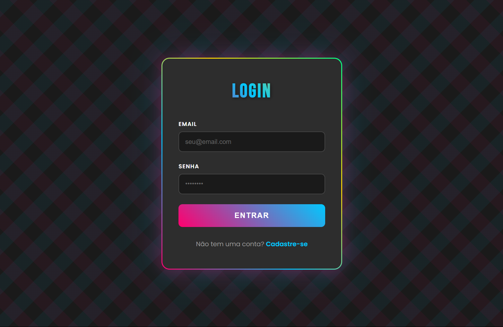
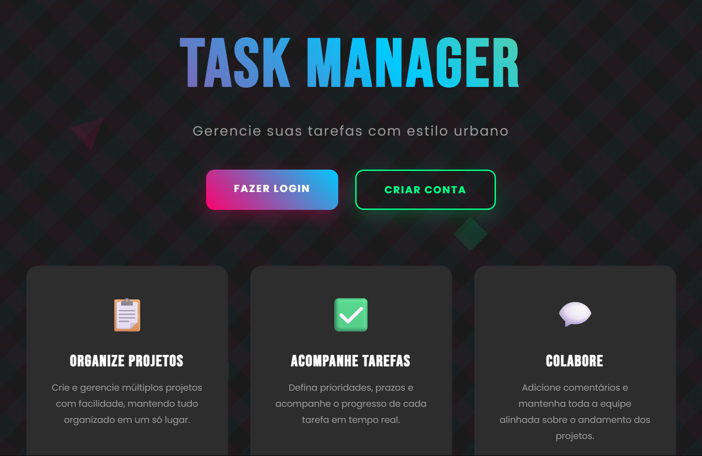
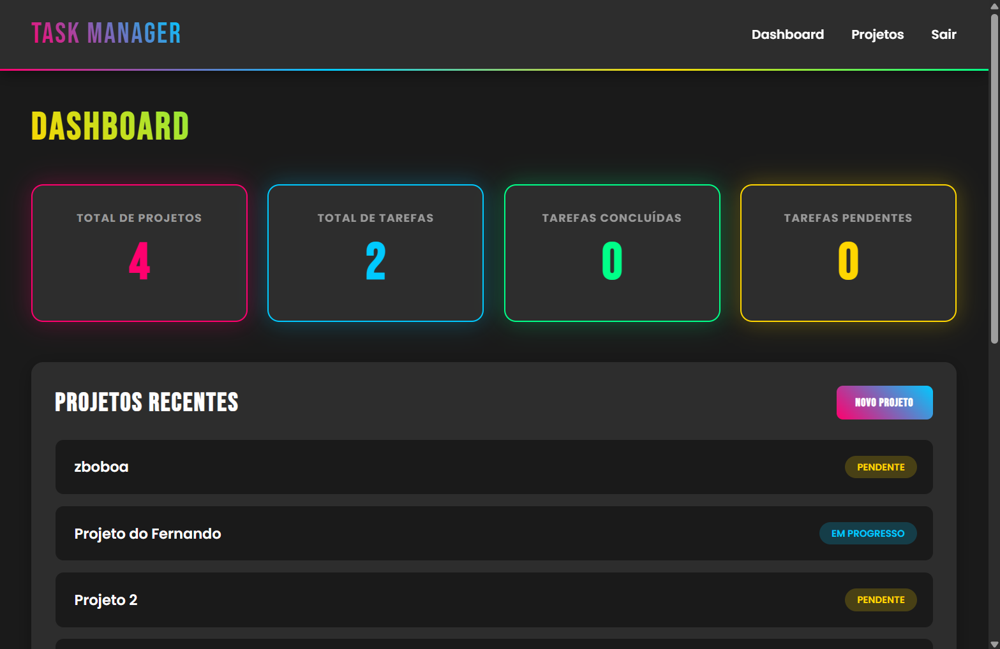

# WAD - Web Application Document
## Gerenciador de Tarefas

---

### 1. Visão Geral da Aplicação

O **Gerenciador de Tarefas** é um sistema web completo desenvolvido para gerenciamento de projetos e tarefas com funcionalidades de colaboração. A aplicação permite que usuários criem, organizem e acompanhem o progresso de projetos e suas respectivas tarefas, facilitando o trabalho em equipe através de sistema de comentários e atribuição de responsáveis.

**Objetivo Principal:** Centralizar o gerenciamento de projetos pessoais e corporativos, oferecendo controle sobre status, prioridades, prazos e colaboração entre usuários.

### 2. Funcionalidades Principais

#### 2.1 Autenticação e Usuários
- Sistema de login/cadastro com validação
- Autenticação baseada em sessões
- Controle de acesso a páginas protegidas
- Criptografia de senhas com bcrypt

#### 2.2 Gerenciamento de Projetos
- Criação, visualização, edição e exclusão de projetos
- Controle de status (pendente, em progresso, concluído)
- Associação de projetos aos criadores
- Interface para listagem e detalhamento

#### 2.3 Gerenciamento de Tarefas
- CRUD completo de tarefas vinculadas a projetos
- Sistema de prioridades (baixa, normal, alta)
- Definição de prazos e horários
- Atribuição de responsáveis
- Controle de status individual

#### 2.4 Sistema de Comentários
- Comentários em tarefas para colaboração
- Identificação do autor e timestamp
- Funcionalidade de exclusão

#### 2.5 Dashboard
- Visão geral dos projetos do usuário
- Estatísticas e resumos visuais
- Acesso rápido às principais funcionalidades

### 3. Interface da Aplicação

#### 3.1 Página de Login

*Tela de autenticação com campos para email e senha*

#### 3.2 Landing Page

*Página inicial apresentando a aplicação e suas funcionalidades*

#### 3.3 Dashboard Principal

*Painel principal com visão geral dos projetos e estatísticas do usuário*

### 4. Arquitetura Técnica

#### 4.1 Padrão MVC
A aplicação segue rigorosamente o padrão Model-View-Controller:
- **Models:** Representam a estrutura de dados e regras de negócio
- **Views:** Templates EJS para renderização das páginas
- **Controllers:** Processam requisições e coordenam Model e View

#### 4.2 Diagrama Arquitetural MVC

```mermaid
graph TB
    %% Camada de Apresentação (View)
    subgraph "VIEW LAYER"
        V1["`**Landing Page**
        index.ejs`"]
        V2["`**Authentication**
        login.ejs
        cadastro.ejs`"]
        V3["`**Dashboard**
        home.ejs`"]
        V4["`**Projects**
        lista.ejs
        detalhes.ejs
        cadastro.ejs
        editar.ejs`"]
        V5["`**Tasks**
        lista.ejs
        detalhes.ejs
        cadastro.ejs
        editar.ejs`"]
        V6["`**Comments**
        lista.ejs`"]
    end

    %% Camada de Controle (Controller)
    subgraph "CONTROLLER LAYER"
        C1["`**authController**
        - formLogin()
        - login()
        - formCadastro()
        - cadastrar()
        - logout()`"]
        C2["`**dashboardController**
        - home()`"]
        C3["`**projectsController**
        - listar()
        - detalhes()
        - cadastrar()
        - atualizar()
        - deletar()`"]
        C4["`**tasksController**
        - listarPorProjeto()
        - detalhes()
        - cadastrar()
        - atualizar()
        - deletar()`"]
        C5["`**commentsController**
        - listarPorTarefa()
        - cadastrar()
        - deletar()`"]
    end

    %% Camada de Serviço (Business Logic)
    subgraph "SERVICE LAYER"
        S1["`**usersService**
        - autenticar()
        - criarUsuario()
        - validarDados()`"]
        S2["`**dashboardService**
        - obterEstatisticas()
        - resumoProjetos()`"]
        S3["`**projectsService**
        - criarProjeto()
        - atualizarProjeto()
        - validarPermissoes()`"]
        S4["`**tasksService**
        - criarTarefa()
        - atualizarTarefa()
        - gerenciarStatus()`"]
        S5["`**commentsService**
        - adicionarComentario()
        - validarAutoria()`"]
    end

    %% Camada de Modelo (Model/Repository)
    subgraph "MODEL LAYER"
        M1["`**usersRepository**
        - buscarPorEmail()
        - criar()
        - atualizar()`"]
        M2["`**dashboardRepository**
        - obterEstatisticas()
        - contarProjetos()`"]
        M3["`**projectsRepository**
        - listar()
        - buscarPorId()
        - criar()
        - atualizar()
        - deletar()`"]
        M4["`**tasksRepository**
        - listarPorProjeto()
        - buscarPorId()
        - criar()
        - atualizar()
        - deletar()`"]
        M5["`**commentsRepository**
        - listarPorTarefa()
        - criar()
        - deletar()`"]
    end

    %% Banco de Dados
    subgraph "DATABASE LAYER"
        DB["`**PostgreSQL**
        📊 users
        📊 projects
        📊 tasks
        📊 comments`"]
    end

    %% Roteamento
    subgraph "ROUTING LAYER"
        R1["`**authRoutes**
        /login, /cadastro, /logout`"]
        R2["`**dashboardRoutes**
        /dashboard`"]
        R3["`**projectsRoutes**
        /projects/*`"]
        R4["`**tasksRoutes**
        /tasks/*`"]
        R5["`**commentsRoutes**
        /comments/*`"]
    end

    %% Middleware
    subgraph "MIDDLEWARE"
        MW["`**authMiddleware**
        - requireAuth()
        - sessionManager()`"]
    end

    %% Conexões principais do MVC
    V1 --> C1
    V2 --> C1
    V3 --> C2
    V4 --> C3
    V5 --> C4
    V6 --> C5

    C1 --> S1
    C2 --> S2
    C3 --> S3
    C4 --> S4
    C5 --> S5

    S1 --> M1
    S2 --> M2
    S3 --> M3
    S4 --> M4
    S5 --> M5

    M1 --> DB
    M2 --> DB
    M3 --> DB
    M4 --> DB
    M5 --> DB

    %% Roteamento para Controllers
    R1 --> C1
    R2 --> C2
    R3 --> C3
    R4 --> C4
    R5 --> C5

    %% Middleware
    MW --> C2
    MW --> C3
    MW --> C4
    MW --> C5

    %% Estilos
    classDef viewStyle fill:#e1f5fe,stroke:#01579b,stroke-width:2px,color:#000
    classDef controllerStyle fill:#f3e5f5,stroke:#4a148c,stroke-width:2px,color:#000
    classDef serviceStyle fill:#e8f5e8,stroke:#1b5e20,stroke-width:2px,color:#000
    classDef modelStyle fill:#fff3e0,stroke:#e65100,stroke-width:2px,color:#000
    classDef dbStyle fill:#ffebee,stroke:#c62828,stroke-width:3px,color:#000
    classDef routeStyle fill:#f1f8e9,stroke:#33691e,stroke-width:2px,color:#000
    classDef middlewareStyle fill:#fce4ec,stroke:#880e4f,stroke-width:2px,color:#000

    class V1,V2,V3,V4,V5,V6 viewStyle
    class C1,C2,C3,C4,C5 controllerStyle
    class S1,S2,S3,S4,S5 serviceStyle
    class M1,M2,M3,M4,M5 modelStyle
    class DB dbStyle
    class R1,R2,R3,R4,R5 routeStyle
    class MW middlewareStyle
```


#### 4.3 Estrutura de Camadas
- **View Layer:** Templates EJS para renderização das interfaces
- **Controller Layer:** Processamento de requisições e coordenação
- **Service Layer:** Implementação das regras de negócio
- **Model Layer:** Repositories para acesso e manipulação de dados
- **Database Layer:** PostgreSQL com estrutura relacional
- **Routing Layer:** Definição e organização das rotas
- **Middleware:** Autenticação e controle de acesso

#### 4.3 Stack Tecnológica
- **Backend:** Node.js + Express.js
- **Banco de Dados:** PostgreSQL
- **Template Engine:** EJS
- **Autenticação:** express-session + bcrypt
- **Validação:** Joi
- **Outros:** method-override, dotenv, pg

### 5. Modelo de Dados

#### 5.1 Diagrama Relacional

*Estrutura do banco de dados com relacionamentos entre entidades*

#### 5.2 Entidades Principais
- **Users:** Armazena dados dos usuários do sistema
- **Projects:** Projetos criados pelos usuários
- **Tasks:** Tarefas vinculadas aos projetos
- **Comments:** Comentários nas tarefas para colaboração

### 6. API e Rotas

#### 6.1 Endpoints de Autenticação
- `GET /login` - Formulário de login
- `POST /login` - Processar autenticação
- `GET /cadastro` - Formulário de registro
- `POST /cadastro` - Criar nova conta
- `GET /logout` - Encerrar sessão

#### 6.2 Endpoints de Projetos
- `GET /projects` - Listar projetos
- `GET /projects/new` - Formulário de criação
- `POST /projects` - Criar projeto
- `GET /projects/:id` - Detalhes do projeto
- `PUT /projects/:id` - Atualizar projeto
- `DELETE /projects/:id` - Excluir projeto

#### 6.3 Endpoints de Tarefas
- `GET /projects/:id/tasks` - Tarefas do projeto
- `GET /tasks/new` - Formulário de criação
- `POST /tasks` - Criar tarefa
- `GET /tasks/:id` - Detalhes da tarefa
- `PUT /tasks/:id` - Atualizar tarefa
- `DELETE /tasks/:id` - Excluir tarefa

#### 6.4 Endpoints de Comentários
- `GET /tasks/:id/comments` - Comentários da tarefa
- `POST /tasks/:id/comments` - Criar comentário
- `DELETE /comments/:id` - Excluir comentário

### 7. Segurança e Validação

#### 7.1 Medidas de Segurança
- Senhas criptografadas com bcrypt
- Middleware de autenticação em rotas protegidas
- Validação de dados com Joi
- Sanitização de entradas do usuário

#### 7.2 Validações Implementadas
- Formato de email válido
- Senhas com critérios mínimos
- Campos obrigatórios em formulários
- Validação de tipos de dados

### 8. Instalação e Execução

#### 8.1 Pré-requisitos
- Node.js (versão 14+)
- PostgreSQL
- npm ou yarn

#### 8.2 Configuração Rápida
```bash
# 1. Clonar repositório
git clone <repositório>
cd gerenciador-de-tarefas

# 2. Instalar dependências
npm install

# 3. Configurar variáveis de ambiente
cp .env.exemple .env

# 4. Configurar banco de dados
createdb gerenciador_tarefas
psql -d gerenciador_tarefas -f scripts/init.sql

# 5. Executar aplicação
npm start
```

### 9. Testes e Qualidade

#### 9.1 Arquivo de Testes REST
O projeto inclui um arquivo `rest.http` completo com:
- Testes de todas as funcionalidades
- Cenários de validação
- Testes de segurança
- Fluxos completos de uso

#### 9.2 Estrutura de Testes
- Testes de autenticação
- Validação de endpoints
- Cenários de erro
- Testes de integração

### 10. Conclusão

O **Gerenciador de Tarefas** representa uma solução completa para gerenciamento de projetos, implementando as melhores práticas de desenvolvimento web com Node.js. A arquitetura MVC bem estruturada, combinada com um banco de dados relacional robusto, oferece uma base sólida para futuras expansões e melhorias.

A aplicação demonstra competência técnica em desenvolvimento full-stack, desde a modelagem de dados até a implementação de interfaces responsivas, passando por aspectos cruciais como segurança e validação de dados.

---

**Projeto Acadêmico** | **Autor:** Daniel Polakiewicz Guilger  
**Tecnologias:** Node.js, Express, PostgreSQL, EJS  
**Padrão Arquitetural:** MVC